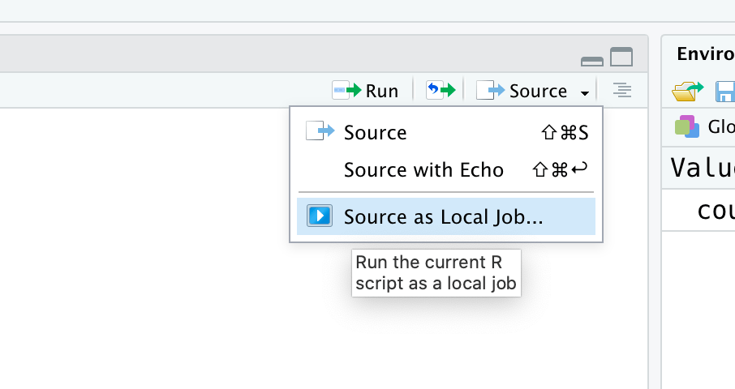

```{r setup, include=FALSE}
knitr::opts_chunk$set(echo = TRUE)
```

# *GWDG* HPC

## Introduction
The aim of this guide is to explain how to use a local `R` session and submit jobs to the [*GWDG* High Performance Cluster](https://info.gwdg.de/docs/doku.php?id=en:services:application_services:high_performance_computing:start) (HPC) and retrieve the results in the same `R` session (requires *GWDG* account). The big advantage of this is that working locally in an IDE (e.g. [RStudio](https://www.rstudio.com)) is way more convenient than working with Linux shell on the HPC. Also, it is not necessary
to manually copy data to the HPC (and vice versa). The structure of this guide is heavily influenced by our own mistakes and we hope to make it somewhat easier for future HPC user.

In general, our setup should also work with any other HPC and the code snippets should be usable for other scheduling systems than [**SLURM**](https://slurm.schedmd.com) (which is used by the *GWDG*) with slight modifications. To see the outdated version of this guide for [**LSF**](https://www.ibm.com/support/knowledgecenter/en/SSWRJV_10.1.0/lsf_welcome/lsf_welcome.html), there is a GitHub branch called *LSF* in [this repo](https://github.com/r-spatialecology/gwdg_hpc_guide).

## General setup

The user account must be activated to use the HPC. Therefore, an e-mail to [hpc@gwdg.de](mailto:hpc@gwdg.de) asking to activate the account must be sent.

### 1. Check Linux shell

The Linux shell must be set to `/bin/ksh` (and not `/bin/sh`). It's possible to set this in the user settings at [www.gwdg.de](www.gwdg.de).

### 2. SSH Key
For a convenient login and to use `R` via SSH connector, a SSH key is needed on the HPC (private key on local computer, public key on HPC).

Using *Linux* or *macOS* and *Windows 10*, it is straightforward to generate a SSH key and copy it to the HPC using the shell/terminal.

```{bash eval = FALSE}
ssh-keygen -t rsa -b 2048 -f <yourkey>
```

For older *Windows* versions, [this guide](https://docs.joyent.com/public-cloud/getting-started/ssh-keys/generating-an-ssh-key-manually/manually-generating-your-ssh-key-in-windows) seems to cover how to connect via SSH.

Once you generated the SSH key, locate the public key (make sure to never share your private key!). The default location of all SSH keys is the .ssh/ folder, which might be hidden. Login to your *GWDG* account, go to "My account" and find "Other Settings". There you can now copy the public key. For more information about connecting via SSH, please see ["CONNECT WITH SSH"](https://info.gwdg.de/docs/doku.php?id=en:services:application_services:high_performance_computing:connect_with_ssh) by the *GWDG*. 

The HPC's frontend nodes are only accessible from within [GÖNET](https://info.gwdg.de/docs/doku.php?id=en:services:network_services:goenet:start), i.e. either from your office, via VPN or via a proxy: `login.gwdg.de`. To use the proxy, you want to use a [ssh config file](https://info.gwdg.de/docs/doku.php?id=en:services:application_services:high_performance_computing:connect_with_ssh#saving_the_ssh_configuration) like this:

```{bash eval = FALSE}
host gwdg-login #can be any name you want
  hostname login.gwdg.de
  user <*YOUR_USERNAME*>
  IdentityFile ~/.ssh/<yourkey>
 
host hpc-gwdg 
  hostname gwdu102 # or gwdu101 or gwdu103
  user <*YOUR_USERNAME*>
  IdentityFile ~/.ssh/<yourkey>
  ProxyJump gwdg-login
```

In the following we assume that ssh is set up with keys and config file and you are able to connect to the hpc with the following command:

```{bash eval = FALSE}
ssh hpc-gwdg
```

### 3. Create .profile

Because `.bashrc` is not sourced by Scientific Linux by default ([source](https://info.gwdg.de/docs/doku.php?id=en:services:application_services:high_performance_computing:bashrc)), firstly a `.profile` file is created. The following code enables that `.bashrc` is sourced every time the HPC is accessed.

```{bash eval = FALSE}
nano .profile
```

```{bash eval = FALSE}
case "$SHELL" in
/bin/bash)
    . /etc/bashrc
    . .bashrc
    ;;
/usr/bin/bash)
    . /etc/bashrc
    . .bashrc
    ;;
/usr/local/bin/bash)
    . /etc/bashrc
    . .bashrc
    ;;
*)  ;;
esac
```

### 4. Create .bash-files

Now, the `.bashrc` file is sourced every time the HPC is accessed. This is convenient because it allows to set default settings, load aliases or modules. To keep everything organized, within `.bashrc` again different files are sourced (if they are present). This includes `.bash_aliases` and `.bash_modules`.

```{bash eval = FALSE}
nano .bashrc
```

```{bash eval = FALSE}
# .bashrc
# Source global definitions
if [ -f /etc/bashrc ]; then
    . /etc/bashrc
fi

# load aliases
if [ -f ~/.bash_aliases ]; then
    . ~/.bash_aliases
fi

# load modules
if [ -f ~/.bash_modules ]; then
    . ~/.bash_modules
fi
```

Here are some convenient aliases that could be saved in the `.bash_aliases` file (created using `nano` as before). `.bash_aliases` makes sure they are available on the HPC and allow an easier application of common **SLURM** commands. Of course, this list can be expanded by any alias required. This does not only include **SLURM** commands, but can also include *Linux* commands.

```{bash eval = FALSE}
alias jobs_all='squeue --format="%.12i %.12j %.8u %.3P %.3q %.10l %.10M %.5D %.4C %.7m %16R %.8T %.12p"'
alias jobs_med='squeue --partition=medium --format="%.12i %.12j %.8u %.3P %.3q %.10l %.10M %.5D %.4C %.7m %16R %.8T %.12p"'
alias jobs_fat='squeue --partition=fat --format="%.12i %.12j %.8u %.3P %.3q %.10l %.10M %.5D %.4C %.7m %16R %.8T %.12p"'

alias jobs_own='squeue -u $USER --format="%.12i %.12j %.8u %.3P %.3q %.10l %.10M %.5D %.4C %.7m %16R %.8T"'
alias jobs_run='squeue -u $USER --states=RUNNING --format="%.12i %.12j %.8u %.3P %.3q %.10l %.10M %.5D %.4C %.7m %16R %.8T"'
alias jobs_pen='squeue -u $USER --states=PENDING --format="%.12i %.12j %.8u %.3P %.3q %.10l %.10M %.5D %.4C %.7m %16R %.8T"'
alias jobs_n='squeue -u $USER --states=RUNNING | wc -l'
alias jobs_kill='scancel -u $USER'
alias jobs_info='sacct -u $USER --units=G --format=JobID,JobName,Partition,QOS,Timelimit,Elapsed,AllocNodes,AllocCPU,ReqMem,MaxRSS,State'

alias fairshare='sshare -U $USER'
alias monitor='htop -u $USER'

alias rm_logs='rm -rf *.log'
alias rm_future='rm -rf .future/'

alias ls='ls -l'
alias lsa='ls -l -a'
```

Software on the hpc is [organized with `modules` and `spack`](https://info.gwdg.de/docs/doku.php?id=en:services:application_services:high_performance_computing:spack_and_modulefiles). Modules provide a way to selectively load and unload pre-installed software to the user environment. To see all available modules, use `module available`. `Spack` allows the users to install and load additional software from th [Spack repository](https://spack.readthedocs.io/en/latest/package_list.html).

To be able to automatically import modules, `.bash_modules` (again, using `nano`) needs to be created. Mine looks like this:

```{bash eval = FALSE}
module load r
module load spack-user
# Enabling Spack Shell Support
source $SPACK_USER_ROOT/share/spack/setup-env.sh
spack load libzmq
```

### 5. Try to run `R` on the HPC

If the previous steps all worked out, it should be possible to login to HPC without typing a password. If so, using `R` should be no problem now. The following command logs in to the HPC frontend and starts a `R` terminal.

```{bash eval = FALSE}
ssh hpc-gwdg
R
```

## *GWDG* HPC infrastructure

The HPC infrastructure is mostly accessible through partitions (formerly queues). A full overview can be found here: [High Performance Computing](https://info.gwdg.de/docs/doku.php?id=en:services:application_services:high_performance_computing:start). There are two general base partitions that are of interest.

* **medium** - lots of cores, fewer memory, short pending time
* **fat** - fewer cores, lots of memory, long pending time

Both partitions have additional a ["quality of service" (QOS)](https://info.gwdg.de/docs/doku.php?id=en:services:application_services:high_performance_computing:running_jobs_slurm#runtime_limits_qos), i.e. "normal", "short" and "long". This refers to the maximum walltime a job can run on the HPC. Of course this also relates to possible pending times. Generally, the possible pending time might be longer in the "long" QOS. However, once a job is running, it's also allowed to use the partition longer. "short" is intended for testing and development, not for massive production.

There is a maximum number of jobs that can be submitted, as well as a maximum of simultaneously running jobs. The following command allows to check the limits on the HPC. The default is a submission of maximum 5000 jobs at a time and 1000 jobs running simultaneously.

```{bash eval = FALSE}
sacctmgr -s show user $USER
```

More details can be found here.

* [RUNNING JOBS WITH SLURM](https://info.gwdg.de/dokuwiki/doku.php?id=en:services:application_services:high_performance_computing:running_jobs_slurm)
* [OUTDATED RUNNING JOBS (FOR EXPERIENCED USERS)](https://info.gwdg.de/dokuwiki/doku.php?id=en:services:application_services:high_performance_computing:running_jobs_for_experienced_users)

### sbatch command

The **SLURM** command `sbatch` is used to submit jobs to the HPC. This is important to remember to adjust submissions of jobs and understand error messages. Regular `R` syntax is only used as a proxy.

### General **SLURM** commands

Here are the previously defined aliases for the most important **SLURM** commands to monitor and control jobs on the HPC. Of course, it is possible to change this list by modifying `.bash_aliases`. Also, it's possible to combine all aliases with the default **SLURM** options or just use the original **SLURM** commands.

* `sinfo`: General information about all partitions
* `jobs_p`/`jobs_med`/`jobs_fat`: All jobs submitted to all/medium/fat partition(s)
* `jobs_user`/`jobs_run`/`jobs_pen`: Only own all/running/pending submitted jobs
* `jobs_n`: Number of own running jobs. Because the header is counted, actual count is n - 1
* `jobs_kill`: Kill all submitted jobs
* `jobs_info`: Information about finished jobs

### Loading modules

As described above, modules help to select software versions needed to run code. The following command displays all available modules provided by the *GWDG*.

```{bash eval = FALSE}
module avail
```

Modules can be loaded using the following command and the name of the corresponding module.

```{bash eval = FALSE}
module load R
```

It is possible to list all loaded modules. This list should at least contain all modules specified in the `.bash_modules` file plus all later additionally loaded modules.

```{bash eval = FALSE}
module list
```

Disconnecting and reconnecting via ssh also removes all modules (with exception of those specified in the `.bash_modules` file). To detach selected modules or all modules at once without logging out, the `purge` command can be used.

```{bash eval = FALSE}
module purge R
module purge
```

## Installing packages

All packages used in a local scripts must also be also installed on the HPC. This must be done for all `R` versions separately, i.e. if `R` is updated on the HPC, all packages must be re-installed. The easiest way to install packages on the HPC is to login to the frontend and start `R`.

Installing `R` packages works as expected. The only difference to installing packages locally is that `R` might asks to use the private library of the user (in which the user has writing rights).

```{r eval = FALSE}
# For example
install.packages("tidyverse")
```

To install packages from [GitHub](https://github.com/) it is necessary to specify the path to the private library. Therefore, first the `devtools` and `withr` packages need to be installed. Now, the path can be provided where the package should be installed. It's possible to get this path using `.libPaths()`. This path is wrapped around the `install_github()` function. Make sure to check the correct path each time you use a different `R` version.

```{r eval = FALSE}
install.packages("devtools")
install.packages("withr")

# and look for your .libPath
.libPaths()

withr::with_libpaths(new = "/usr/users/*YOUR_USERNAME*/R/x86_64-pc-linux-gnu-library/3.5",
                     code = devtools::install_github("r-spatialecogy/landscapemetrics")
```
## Using the rslurm package

The great advantage of the `rslurm` package is that it can be used with almost no setup on the HPC side at all. Just the `rslurm` package itself needs to be installed on the HPC. `rslurm` automatically creates all files, including a shell script that can be passed on to Slurm's `sbatch` command directly. In contrast to the `clustermq` and `future` packages, `rslurm` jobs cannot be submitted from a local `R` session to the HPC, but the shell script has to be run on the HPC's frontend node directly (connect via ssh).

The following example is adapted from [here](https://github.com/SESYNC-ci/rslurm).

First, we need an example function to be run on the HPC:

```{r eval = FALSE}
library(rslurm)

fx = function(x, y) x * 2 + y
```

You ca either use a data frame or a list to provide the parameter combinations for the function to `rslurm`. Here we create a data frame with five jobs, each in a row:

```{r eval = FALSE}
par_df <- data.frame(x = 1:5)
```

The `slurm_apply` function allows to compute the function for each parameter combination of the created `data.frame` (use `slurm_map` for the same just a `list` as input). It is important that the columns of the `data.frame` have identical names as the function arguments. Function arguments that should be constant for all jobs can be passed directly after the data frame (`y` in the example below). 

`rslurm` needs the path of the `Rscript` command on the HPC during the `slurm_apply()` function call. To identify the correct path on the HPC, run the following line in a `R` session **on** the HPC:

```{r eval = FALSE}
file.path(R.home("bin"), "Rscript")
```
Use this path as `rscript_path` argument for `slurm_apply` function.

The `slurm_options` argument allows to pass on any options (as a list) that will be used as `#SBATCH` commands in the `submit.sh` script used to submit the jobs. Make sure to also check out the `global_objects` and `pkgs` argument to control which objects and packages will be loaded on each cluster node. In this example, we are going to request one CPU per node, and spread the jobs across a maximum number of nodes equal to the defined parameter combinations (so each parameter combination can run on its own node with one CPU available).

When running this script on a local machine, it is important to set `submit = FALSE`. This ensures that the jobs are not submitted, but only all necessary scripts are created for `sbatch`. Running the function will create a `_rslurm_[jobname]` folder in the working directory. If the `R` script is run directly on the HPC, `submit = TRUE` even submits the jobs directly.

```{r eval = FALSE}
sjob <- slurm_apply(f = fx, 
                    params = par_df, 
                    y = 10,
                    jobname = 'my_first_test',
                    nodes = nrow(par_df), 
                    cpus_per_node = 1,
                    rscript_path = "$HOME/.spack/install/haswell/gcc-9.3.0/r-4.0.3-5z5kqf/rlib/R/bin/Rscript", # adjust to your Rscript path
                    slurm_options = list("time" = "00:05:00", 
                                         "mem-per-cpu" = "1G",
                                         "mail-type" = "ALL",
                                         "mail-user" = "your@e-mail.org"),
                    submit = FALSE)
```

The `_rslurm_[jobname]` folder needs to be uploaded to the HPC. In RStudio, you can just go to the `Terminal` tab and use `scp` to upload the `_rslurm_[jobname]` folder (some HPC frontend nodes do not allow direct uploads, e.g. for the GWDG you'll need to use `transfer.gwdg.de` instead):

```
scp -r _rslurm_my_first_test *YOUR_USERNAME*@transfer.gwdg.de:~/
```

Then you can `ssh` into the HPC frontend node and navigate to the job folder using `cd _rslurm_[jobname]`. The jobs can be submitted using 
```
sbatch submit.sh
```
This will submit the jobs and create `result_1..i.rds` files in the jobs folder, one for each row of the parameter data frame. 

After all jobs are finished, the folder can be downloaded. Again, in RStudio go to the `Terminal` tab and use `scp`
```
scp -r *YOUR_USERNAME*@transfer.gwdg.de:~/_rslurm_my_first_test ./
```

As the results are just `RDS` files, you could just read them into the `R` using `readRDS()` but `rslurm` provides a convenient `get_slurm_out` function to either row-bind results to a `data.frame` (`outtype = "table"`) or as a list (`outtype = "raw"`, default):

```{r eval = FALSE}
results <- get_slurm_out(slr_job =  sjob, outtype = "table")
> results
  V1
1 12
2 14
3 16
4 18
5 20
```

In case the default `submit.sh` file is not working on the HPC, you can either modify it by hand or create a custom template that can be provided as `sh_template` argument to the `slurm_apply()` function call. One reason could be for example, if modules need to be loaded. Here is an exemplary template that loads two modules (which you can also do in your `.bash_modules`, see section `Create .bash-files`):

```{bash eval = FALSE}
#!/bin/bash

#SBATCH --job-name={{{jobname}}}
#SBATCH --array=0-{{{max_node}}}{{{job_array_task_limit}}}
#SBATCH --cpus-per-task={{{cpus_per_node}}}
{{#flags}}
#SBATCH --{{{name}}}
{{/flags}}
{{#options}}
#SBATCH --{{{name}}}={{{value}}}
{{/options}}

module load gcc/8.2.0
module load R/4.0.2

{{{rscript}}} --vanilla slurm_run.R
```

## Other approaches to use R on HPC
### Using the clustermq package

`clustermq` is a package that allows to submit jobs to the HPC via SSH connector. Compared to `future` (see below), it has the advantage that it submits job arrays. Instead of gradually sending job after job, as done in the examples before, `clustermq` sends them all at once. This can be a huge time benefit. However, currently `clustermq` is only working on *Linux* and *macOS* (see [#84](https://github.com/mschubert/clustermq/issues/84), [#238](https://github.com/mschubert/clustermq/issues/238)).

First, all necessary dependencies need to be installed on the local system if you use *Linux*. 

```{bash eval=FALSE}
# You can skip this step on Windows and macOS
brew install zeromq # Linuxbrew, Homebrew on macOS
conda install zeromq # Conda
sudo apt-get install libzmq3-dev # Ubuntu
sudo yum install zeromq3-devel # Fedora
pacman -S zeromq # Archlinux
```

To use `clustermq`, it has to be installed on both the local computer and the HPC. To install `clustermq` on the HPC first install the library `libzmq`:

```{bash eval = FALSE}
# first unload all compiler modules, otherwise Spack might be confused with different versions
module purge gcc 

# the Spack module is needed
module load spack-user

# Enabling Spack shell support for loading spack modules
. /opt/sw/rev/20.12/haswell/gcc-9.3.0/spack-user-0.16.0-qbaee6/share/spack/setup-env.sh

# install and load libzmq
spack install libzmq
spack load libzmq
```

Then load the R module (`module load r`), open an R Terminal with the command `R` and use `install.packages("clustermq")` 

**Note**: do *not* install the github version with `remotes::install_github('mschubert/clustermq')` until issue [#223](https://github.com/mschubert/clustermq/issues/223) is solved. 

Afterwards, the local `.Rprofile` needs to be modified. This can be done with the `usethis` package.

```{r eval=FALSE}
usethis::edit_r_profile()
```

```{r eval=FALSE}
options(
    clustermq.scheduler = "ssh",
    clustermq.ssh.host = "gwdg-hpc", # use your user and host, obviously
    clustermq.ssh.log = "~/clustermq_ssh.log", # log for easier debugging
    clustermq.ssh.timeout = 30 # in s, spack load in your .bashrc takes some time
)
```

Also the `.Rprofile` on the HPC (`nano .Rprofile` in the home directory) needs to be modified.

```{r eval=FALSE}
options(
    clustermq.scheduler = "slurm",
    clustermq.template = "/usr/users/*YOUR_USERNAME*/clustermq_slurm.tmpl"
)
```

Then, again an template to submit jobs is needed, e.g. `nano clustermq_slurm.tmpl`. The template submits jobs to the HPC specifying the options the scheduling system uses.

```{bash eval=FALSE}
#!/bin/sh
#SBATCH --job-name={{ job_name }} # job name
#SBATCH --array=1-{{ n_jobs }} # number of processes
#SBATCH --partition={{ queue | medium }} # name of queue 
#SBATCH --qos={{ service | normal }} # which special QOS (short/long)
#SBATCH --time={{ walltime | 12:00:00 }} # walltime in hh:mm:ss
#SBATCH --cpus-per-task={{ n_cpu | 1 }} # set cores per task 
#SBATCH --mem-per-cpu={{ mem_cpu | 1024 }} # set min memory per core 
#SBATCH --nodes={{ nodes | 1 }} # if 1 put load on one node
#SBATCH --output={{ log_file | /dev/null }}
#SBATCH --error={{ log_file | /dev/null }}

ulimit -v $(( 1024 * {{ mem_cpu | 1024 }} ))
CMQ_AUTH={{ auth }} R --no-save --no-restore -e 'clustermq:::worker("{{ master }}")'
```

1. ### How to use clustermq

`clustermq` does not rely on plans as `future`. Submitting jobs becomes as easy as providing a function and a list or vector to iterate over. In the example, for each `x = 1...5` a single job is submitted to the HPC. Contrastingly, `y = 10` is hold constant for all submitted jobs. In case user-defined functions are needed, these can be specified by the the `export` argument of the `Q()` function. It's also possible to iterate over rows of a data frame.

```{r eval=FALSE}
library(clustermq)

fx = function(x, y) x * 2 + y
Q(fx, x = 1:5, const = list(y = 10), n_jobs = 1)
```

```{r eval=FALSE}
# Run a simple multiplication for data frame columns x and y on a worker node
fx = function (x, y) x * y

df = data.frame(x = 5, y = 10)

Q_rows(df, fx, job_size = 1)

# Q_rows also matches the names of a data frame with the function arguments
fx = function (x, y) x - y

df = data.frame(y = 5, x = 10)

Q_rows(df, fx, job_size = 1)
```

All parameters within ``{{ }}`` in the template file can be specified using a list and the `template` argument of the `Q()` function. Therefore, it is very easy to e.g. submit to the short *QOS* and set the walltime to 5 minutes (<hh:mm:ss>). Of course, additional arguments can be added to the template.

```{r eval=FALSE}
Q(fx, x = 1:3, const = list(y = 10), n_jobs = 3, 
  template = list(walltime = "00:05:00", 
                  service = "short"))
```


### Using plain R-Scripts

You can run R-Scripts with the `sbatch` command directly from the HPC frontend node. You can add the #SBATCH options to the top of your R script and submit it with sbatch. Slurm will take any script
e.g. 

```{r eval = FALSE}
#!/usr/bin/env Rscript
#SBATCH -n 4
#SBATCH -o rtest.out

test = c('test2','test1')
test
system("hostname")
```

That will work with `sbatch <scriptname>` as long as you loaded the R module.

### Using the future package

This used to be our preffered way, but `clustermq` is just more stable to use. This guide might therefore a bit dated.

One of the ways to use the *GWDG* HPC is the `future` package and framework. The advantage of `future` is that code can be run on the HPC with only minor changes. Furthermore, specifying how  to parallelise the `R` code is straightforward, as to control how to distribute jobs over nodes and cores. A [basic knowledge](https://github.com/HenrikBengtsson/future) of `future` is advised.

#### 1. Create template to submit jobs

A template file is used to control how jobs are submitted to the HPC. This allows to pass arguments as `R` syntax from the local `R` session to the **SLURM** system as `sbatch` commands. The template file, called e.g. `future_slurm.tmpl`, needs to be created on the HPC (same same `nano future_slurm.tmpl`). The following is an example for such a template file allowing to specify the most important `sbatch` options.

```{bash eval = FALSE}
## Default resources can be set in your .batchtools.conf.R by defining the variable
## 'default.resources' as a named list.

#!/bin/sh
#SBATCH --job-name <%= resources$job_name %> ## Name of the job
#SBATCH --ntasks <%= resources$n_cpu %> ## number of processes
#SBATCH --partition <%= resources$queue %> ## Job queue
#SBATCH --qos <%= resources$service %> ## QOS
#SBATCH --time <%= resources$walltime %> ## walltime in hh:mm:ss
#SBATCH --mem-per-cpu <%=resources$mem_cpu %>	## min memory per core
#SBATCH --nodes <%= resources$nodes %> ##  if 1 put load on one node
#SBATCH --output <%= resources$log_file %> ## Output is sent to logfile, stdout + stderr by default

## Export value of DEBUGME environment var to slave
export DEBUGME=<%= Sys.getenv("DEBUGME") %>

module load gcc
module load R

Rscript -e 'batchtools::doJobCollection("<%= uri %>")'
```

#### 2. First login

**Every package from now on needs to be installed on both the local computer and the HPC!**

The following `R` code sends every `future` to the HPC, as specified by the `future` plan.

```{r eval = FALSE}

# load the packages
library("future.batchtools")
library("future")
library("furrr")

# now we specify a future topology that fits our HPC
# login node -> cluster nodes -> core/ multiple cores
login <- tweak(remote, workers = "gwdu101.gwdg.de", user = "*YOUR_USERNAME*") # user = login credential

sbatch <- tweak(batchtools_slurm, template = "future_slurm.tmpl",
                resources = list(job_name = "run_hpc",     # name of the job
                                 log_file = "run_hpc.log", # name of log file
                                 queue = "medium", # which partition
                                 service = "short", # which QOS
                                 walltime = "00:05:00", # walltime <hh:mm:ss>
                                 n_cpu = 12)) # number of cores

plan(list(
  login,
  sbatch,
  multisession # how to run on nodes, could also be sequential
))
```

#### 3. Going down the future topology

Now it's possible to reach the **first level** of the HPC (frontend). After logging in to *gwdu101.gwdg.de*, the function `Sys.info()` is executed on the frontend of the HPC.

```{r eval = FALSE}
# Before we start, despite that we have declared our future plan above,
# we are still working on our local machine if we do not use futures:
local_sysinfo <- Sys.info()

local_sysinfo

# To do something on the hpc, we actually have to use a future,
# in the following example with the future assignment %<-%
hpc_sysinfo %<-% Sys.info()

hpc_sysinfo
```

The **second level**, the cluster nodes, can be reached  with a nested `future`. The `furrr` packages allows to use the `purrr::map`-family as `futures`. The `future`-operator `%<-%` is used to accesses the HPC frontend and `future_map` to accesses the second level cluster nodes. Because code should never be executed on the frontend, these two nested `future` levels are always required to submit jobs. The second level also controls the total number of jobs submitted. This becomes very important later for sequential job submission and exclusive jobs with `future`.

```{r eval = FALSE}
# do something on the cluster node level
hpc_sysinfo_on_nodes  %<-%  future_map(seq_len(10), ~ Sys.info())

hpc_sysinfo_on_nodes
```

The **third level**, the cores on each cluster node, is addressed by the settings specified in the second level. For example, in the second level `multisession` with `processes = 12` can specified. This means demanding 12 cores on each cluster node and run the function parallel on each. Hence, the function could run on 12 cores and use the memory every core comes with. Here, the jobs are distributed over 10 nodes that have at least 12 available cores. In total, `Sys.info()` is executed 10 x 12 times. Therefore, `hpc_sysinfo_on_node_cores` is a two dimensional list, with 10 elements where each of these has again 12 elements. The 12 elements in each outer dimension of the list should be the same, but differ between the unique outer elements overall.

```{r eval = FALSE}
# do something on core level of each cluster node
hpc_sysinfo_on_node_cores  %<-%  future_map(seq_len(10), function(x){
  future_map(seq_len(12), ~ Sys.info())
})
```

#### 4. Submitting jobs efficiently 

The `future` plans are crucial, as they specify how to distribute jobs. Therefore, before submitting jobs to the HPC it is important to ensure that the architecture of the plan and how the code is parallelised match. Otherwise, it may be possible to bypass the scheduling system and drain resources from other users.

The following code snippet explains how to access specific partitions, set the walltime and design a sequential plan. This setup makes sense if the jobs depend of each other, need a specific chip infrastructure or have memory needs that are only satisfied if whole cluster nodes are blocked and jobs are run there exclusively.

```{r eval = FALSE}
# login node -> cluster nodes -> core/ multiple cores

# there shouldn't be to much change for the login level of your plan
# you specify the address of the hpc and your user name
login <- tweak(remote, workers = "gwdu101.gwdg.de", user = "*YOUR_USERNAME*")

# the sbatch, or cluster node, level becomes the first stage
# where you could make adjustment to control you experiment.
# This tweak fills out the space between the curly brackets
# in the future_slurm.tmpl file we created on the HPC.
# (scroll to the right to read an explanation of every line)
sbatch <- tweak(batchtools_slurm, template = "future_slurm.tmpl",
                resources = list(job_name = "run_hpc",     # name of the job
                                 log_file = "run_hpc.log", # name of log file
                                 queue = "medium", # which partition
                                 service = "short", # which QOS
                                 walltime = "00:05:00", # walltime <hh:mm:ss>
                                 n_cpu = 12)) # number of cores

plan(list(
  login,
  sbatch,
  multisession # multisession because 12 cores were blocked on the sbatch level
))
```

However, if jobs are independent of each other (e.g. repetitions of the same function) and do not need more memory than one core provides, it makes sense to submit a high number of very small jobs. Instead of blocking a whole node and running the function on all available nodes in parallel (submitted as one job), it is also possible to submit 12 single jobs only demanding one core per job. This has the advantage that the pending time will be decreased enormously. The reason for this is that the jobs will be submitted to any available free slot (1 core) on the cluster. The **SLURM** system automatically schedules these small jobs with a higher priority in order to use the capacities optimally.

```{r eval = FALSE}
# (scroll to the right to read an explanation of every line)
sbatch <- tweak(batchtools_slurm, template = "future_slurm.tmpl",
                resources = list(job_name = "run_hpc",     # name of the job
                                 log_file = "run_hpc.log", # name of log file
                                 queue = "medium", # which partition
                                 service = "short", # which QOS
                                 walltime = "00:05:00", # walltime <hh:mm:ss>
                                 n_cpu = 1)) # number of cores

plan(list(
  login,
  sbatch,
  sequential # we need sequential here, so that every job we submit only runs on a single core
))
```

#### 5. .future folder

`future.batchtools` creates a folder called `.future/` on the HPC in the home directory. In this folder all submitted jobs are collected and the folder structure indicates the date and time of submission. If all jobs are collected successfully and retrieved on the local computer, the folder is empty and only contains a `.sessioninfo.txt`. However, all logs and (partial) results of failed jobs won't be deleted. This also includes jobs that are killed by the user. 

**Note**: It's advisable to remove failed jobs from time to time in the `.future/` folder. After a while, this folder can use up a lot of the disk quota on the HPC.

#### 6. Example

Submit jobs to the HPC with the following requirements: 

* 120 cores to simulate jobs
* More than 10 GB of RAM
* Functions need about 12 hours to run

```{r eval = FALSE}
# load the packages
library("future")
library("furrr")
library("tidyverse")

# login node -> cluster nodes -> core/ multiple cores
login <- tweak(remote, workers = "gwdu101.gwdg.de", user = "*YOUR_USERNAME*")

# We submit to the multipurpose queue with a maximum
# walltime of 48 hours (we specify 15 so that we
# we are not pending that long).
# We furthermore specify 24 processes, which
# automatically means that we reserve nodes
# exclusively (the maximum number of cores on
# mpi nodes is 24, which means if we say 24
# here we wait until a node is not used by anyone).
sbatch <- tweak(batchtools_slurm, template = "future_slurm.tmpl",
                resources = list(job_name = "run_hpc",     # name of the job
                                 log_file = "run_hpc.log", # name of log file
                                 queue = "medium", # which partition
                                 service = "normal", # which QOS
                                 walltime = "00:15:00", # walltime <hh:mm:ss>
                                 n_cpu = 12)) # number of cores

plan(list(
  login,
  sbatch,
  multisession # Again: multisession to distribute over all the cores
))

# let's create an imaginary data frame to iterate over
mydata <- data.frame(x = rnorm(100), y = rnorm(100))
advanced_data <- list(mydata, mydata, mydata, mydata, mydata)

fancy_statistical_model <- future_map_dfr(advanced_data, function(x) {
  future_map_dfr(seq_len(ncol(x)), function(y) {
    single_row <- x[y, ]
    tibble(single_row$x + single_row$y)
  }, .id = "y")
}, .id = "x")
```

## Tips and Tricks

### 1. Kill jobs/R sessions

There is an alias to kill already submitted jobs. In case something goes wrong while submitting jobs, there will be most likely several `R` sessions that do not close by themselves or are open and keep submitting jobs. A convenient way to kill these processes is to login to the HPC frontend and use the defined alias `monitor` to enter the process manger `htop`. With `F9` it's possible to select the `R` processes and kill them. `F10` closes the process manager afterwards.

```{bash eval = FALSE}
jobs_kill
monitor
```

### 2. Better connection to the HPC

One inconvenience is that the connection to HPC from a local `R` session can not be interrupted. If that happens, jobs are lost (using `future` there might be chance to collect every result in the `.future` folder). This also means that running code from a local computer means that it has to be running until everything is finished. When code take several days, this can easily become a problem.

A way we explored for such cases is to use the [GWDG Cloud Server](https://www.gwdg.de/de/server-services/gwdg-cloud-server). If you install there an instance of RStudio Server (a tutorial with docker is [here](https://github.com/bitbacchus/rstudio-docker)), you have a cloud based IDE that you can run from everywhere with access to the internet. By default, the RStudio Server unfortunately breaks the connection every now and then, so you have to tweak it a bit to be permanently accessible. To turn off the suspended session feature, must be specified in a `ression.conf` file. After the line `session-timeout-minutes=0` is added to the file, the server must be restarted (TODO: include this into the docker image).

```{bash eval = FALSE}
cd /etc/rstudio
nano rsession.conf # add line session-timeout-minutes=0
```

```{bash eval = FALSE}
session-timeout-minutes=0
```

```{bash eval = FALSE}
sudo rstudio-server restart
```

The you'll have to setup ssh as described above.

Now you should be able to login from the RStudio Cloud Server Terminal to the HPC directly as usual without any password identification. If so, you should be able to submit jobs to the cluster from the Cloud Server just as from your local machine. If you use `clustermq`, it's not possible to logout and login again to the Cloud Server as long as jobs are running on the HPC. So either, you need to keep the browser window open as long as jobs are running on the HPC, or better run your R-script with "Source as local job":  

## Troubleshooting

Here, we are going to collect some issue we had during the setup and using the cluster at one point or the other. This issues might be rather specific, but maybe you run into the same problems.

### 3.1 Problems with the .Rprofile
There was the problem that `clustermq` kept telling to specify the scheduler, even though the `.Rprofile` was set up correctly. In this case the problem was that there was no empty, new line at the end of the `.Rprofile` file.

### 3.2 Byte character sets
If you use a text editor to create all the template files, it might be possible that hidden characters (e.g. line break commands) are automatically added to the template files. This can also be a problem if you switch between different byte character sets. In case your jobs return errors and you see a lot of e.g. "\r\n" in your template files (or any other files), one possible solution is to run the following command in order to convert the file to a unix character set.

```{bash eval = FALSE}
dos2unix myBatchFile
```

### 3.3 Kill old processes
We advise to make sure all processes are killed from time to time. This includes all submitted and not finished jobs using `jobs_kill` as well as all others processes. Therefore, you can use `monitor` to enter the `htop` and simply kill all processes you see that are somehow related to `R`. This is especially important if you had jobs that didn't finish successfully before.

## Links

* [https://github.com/HenrikBengtsson/future](https://github.com/HenrikBengtsson/future)
* [https://github.com/HenrikBengtsson/future.batchtools](https://github.com/HenrikBengtsson/future.batchtools)
* [https://github.com/mllg/batchtools](https://github.com/mllg/batchtools)
* [https://github.com/DavisVaughan/furrr](https://github.com/DavisVaughan/furrr)
* [https://github.com/mschubert/clustermq](https://github.com/mschubert/clustermq)
* [http://cyberhelp.sesync.org/rslurm/articles/rslurm.html](http://cyberhelp.sesync.org/rslurm/articles/rslurm.html)

## Acknowledgments
Huge thanks to the GWDG HPC team that put quite some effort into installing `R` packages and explaining some HPC basics to us.
Another big thanks to all authors developing nice tools (future, clustermq, batchtools, rslurm) to enable even ecologists to use cluster interfaces `remo::ji("smile")`.